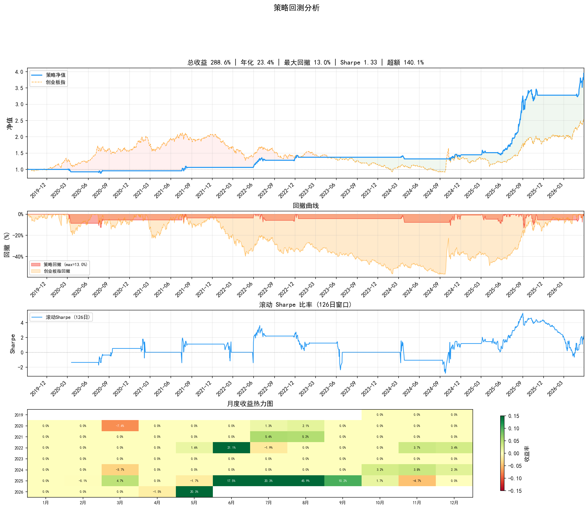

# QuantForge — A股ETF多因子量化交易系统

[](https://www.python.org/)
[](./LICENSE)

基于多因子轮动的A股ETF量化交易系统，覆盖**回测研究 → 参数优化 → 实盘监控**完整链路。策略层与执行层解耦，支持多策略并行、多数据源可插拔。

## 架构概览

```
┌──────────┐    ┌──────────────┐    ┌──────────────┐    ┌──────────────┐    ┌──────────────────┐    ┌──────────────┐
│ DataFeed │───▶│   Strategy   │───▶│   Decision   │───▶│   Resolver   │───▶│  TargetPosition  │───▶│   Executor   │
│  数据源   │    │  策略(信号计算) │    │  决策(语义化)  │    │  仓位决议      │    │  目标仓位列表      │    │  交易执行     │
└──────────┘    └──────────────┘    └──────────────┘    └──────────────┘    └──────────────────┘    └──────────────┘
                      │                                                             │
                      │  indicators/ 技术指标                                       │  config/strategies/
                      │  data_sources/ 多数据源                                     │  JSON参数配置
                      ▼                                                             ▼
               produce_decisions()                                        RankingResolver(Kelly/等权)
```

**核心设计理念**：Strategy 只产出 Decision（语义化决策），不直接执行交易。Decision 经 Resolver 转化为 TargetPosition，再由 Executor 执行。策略逻辑与仓位管理层彻底解耦，同一策略可搭配不同 Resolver 产生不同仓位方案。

| 层 | 职责 | 输入 | 输出 |
|----|------|------|------|
| Strategy | 信号计算、方向判断 | `DataResponse` + 当前持仓 | `list[Decision]` |
| Resolver | 仓位分配、风控 | `list[Decision]` + 可用资金 | `list[TargetPosition]` |
| Executor | 模拟/真实撮合 | `list[TargetPosition]` | 交易记录 + 净值曲线 |

## 特性

- **策略层**：ROC动量轮动、短期反转，支持多因子组合与条件开关系统
- **指标库**：ROC、MA、RSI、MACD、ATR、ADX、Volatility，独立可复用
- **数据源可插拔**：新浪财经（回测）、AutoStock（实盘）、WebScraper（爬虫）
- **回测引擎**：含滑点/手续费建模、多ETF日期对齐、基准对比
- **研究工具链**：FactorLab因子实验室、IC分析、参数扫描、WalkForward验证
- **实盘监控**：monitors/ 层实现策略→实盘的胶水衔接，支持多进程并行
- **测试体系**：29个测试文件，自动发现 + 分层运行（unit/contract/integration/e2e）
- **通知系统**：微信机器人 + 邮件双通道（需自行配置密钥）

## 快速开始

### 1. 环境准备

```bash
# 克隆项目
git clone https://github.com/KwokCecil/quantforge.git
cd quantforge

# 创建虚拟环境
python -m venv .venv

# 安装依赖
.venv\Scripts\pip.exe install -r requirements.txt
```

### 2. 运行回测

```bash
# 默认预设（ROC动量，tech_growth配置）
.venv\Scripts\python.exe main_backtest.py
```

### 3. 运行测试

```bash
# 默认：unit + contract（秒级完成）
.venv\Scripts\python.exe tests/run_all_tests.py
```

## 目录结构

```
quantforge/
├── core/                   # 核心引擎
│   ├── strategy.py         #   Strategy 抽象基类
│   ├── decision.py         #   Decision / DecisionType 数据模型
│   ├── resolver.py         #   Resolver → TargetPosition
│   ├── executor.py         #   BacktestExecutor / LiveExecutor
│   ├── data_feed.py        #   DataFeed → CachedDataFeed（缓存装饰器）
│   ├── config.py           #   StrategyConfig 配置基类
│   ├── indicator.py        #   Indicator 抽象基类
│   └── style_rotator.py    #   风格轮动切换器
│
├── strategies/             # 策略实现
│   ├── roc_momentum.py     #   ROC动量轮动（主力策略）
│   ├── reversal.py         #   短期反转策略
│   ├── _configs/           #   策略配置类（参数定义）
│   └── factory.py          #   策略工厂（按名+预设创建实例）
│
├── indicators/             # 技术指标
│   └── technical.py        #   独立指标实现（不依赖第三方库）
│
├── data_sources/           # 数据源适配
│   ├── sina_feed.py        #   新浪财经数据源
│   ├── autostock_feed.py   #   实盘数据源
│   └── web_scraper_feed.py #   爬虫数据源
│
├── monitors/               # 实盘监控适配器
│   ├── roc_momentum_monitor.py
│   └── _shared.py          #   监控共享逻辑
│
├── research/               # 研究与分析
│   ├── backtest_engine.py  #   回测引擎
│   ├── backtest_analyzer.py #  回测分析报告
│   ├── factor_lab.py       #   因子实验室
│   ├── ic_analysis.py      #   IC 分析
│   ├── param_optimizer.py  #   参数优化器
│   ├── validator.py        #   验证器
│   └── strategy_health.py  #   策略健康度监控
│
├── tests/                  # 自动化测试（29个文件）
│   └── run_all_tests.py    #   测试运行器（自动发现+分层）
│
├── config/                 # JSON 配置
│   ├── strategies/         #   策略预设（json）
│   └── universes/          #   标的池定义
│
├── tools/                  # 工具函数
│   ├── time_utils.py       #   交易日历
│   ├── data_quality.py     #   数据质量检查
│   └── log_format.py       #   日志格式化
│
├── main_backtest.py        # 回测入口
├── main_monitor.py         # 实盘监控入口
├── main_validate.py        # 验证管道入口
└── requirements.txt        # 依赖清单
```

## 回测表现

> **ROC动量轮动 `tech_growth` 预设** · 回测区间 2018-01-01 ~ 2026-05-28 · 基准 创业板指(399006) · git `b404c22`



| 指标 | 策略 | 基准 | 超额 |
|------|------|------|------|
| 总收益率 | **276.15%** | 148.68% | +127.47pp |
| 年化收益率 | **22.81%** | 15.17% | +7.64pp |
| 最大回撤 | 13.05% | — | — |
| Sharpe比率 | 1.31 | — | — |
| Sortino比率 | 0.93 | — | — |
| 交易次数 | 48 | — | — |
| 胜率 | 70.83% | — | — |
| 盈亏比 | 6.06 | — | — |

## 已实现的策略

### ROC 动量轮动 (`roc_momentum`)

核心策略，从ETF池中基于ROC动量排序选取TOP_K品种轮动持有。

| 预设 | 风格 | 说明 |
|------|------|------|
| `all_weather` | 均衡 | 默认配置，兼顾攻防 |
| `sharp_defense` | 防御 | 严止损、低仓位，熊市保护 |
| `max_attack` | 进攻 | 高仓位、宽止损，牛市追击 |
| `tech_growth` | 成长 | 科技成长ETF专项配置 |

条件开关系统：买入/卖出/止损条件均为可配置开关，修改 JSON 即可启用/禁用，无需改代码。

### 短期反转 (`short_term_reversal`)

捕捉短期超跌反弹机会，与动量策略形成风格互补。

## 测试

- **自动发现**：文件名匹配 `_test_*.py` 或 `_verify_*.py` 即可零配置纳入
- **分层运行**：`unit` / `contract` / `integration` / `e2e`
- **核心层重保护**：`core/` 测试遵循"失败模式优先"原则，Mock外部依赖测试内部逻辑

```bash
.venv\Scripts\python.exe tests/run_all_tests.py               # 默认 unit+contract
.venv\Scripts\python.exe tests/run_all_tests.py --all          # 全量
.venv\Scripts\python.exe tests/run_all_tests.py --layers unit  # 指定层
```

## 技术栈

| 组件 | 技术 |
|------|------|
| 语言 | Python 3.10+ |
| 数据处理 | Pandas, NumPy, SciPy |
| 机器学习 | scikit-learn |
| 交易日历 | chinese_calendar |
| 可视化 | Matplotlib |
| 日志 | Loguru |
| 网络请求 | Requests, BeautifulSoup4 |
| Git操作 | GitPython |

## 开源协议

MIT License — 详见 [LICENSE](./LICENSE)。

## 免责声明

**本仓库为代码展示镜像，与实际运行版本有以下差异：**

- **密钥与配置**：`tokens/` 下仅含模板文件（`_templates/`），无真实密钥。按 [1.03_跨设备开发运维指南.md](指导文档/1.03_跨设备开发运维指南.md) 配置后才能运行实盘功能。
- **持仓与日志**：`position/`、`data/`、`logs/`、`results/` 仅保留目录结构（`.gitkeep`），无真实数据。
- **运维脚本脱敏**：`remote_cmd.py` 持仓数据已替换为占位示例，目标日期设为 2099 年。`git_pull.py` 函数名已通用化（`pull_from_remote`）。
- **代码同步**：如直接 clone 运行，回测功能可正常工作（使用新浪财经公开数据源）。实盘监控需自行配置 `tokens/` 和 Windows 计划任务。

本项目仅为技术展示与学习交流之用，不构成任何投资建议。